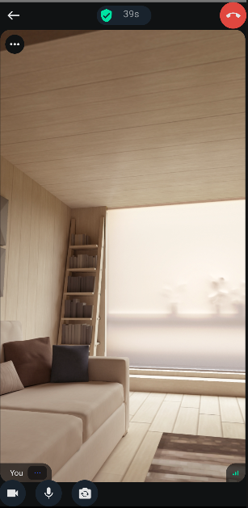
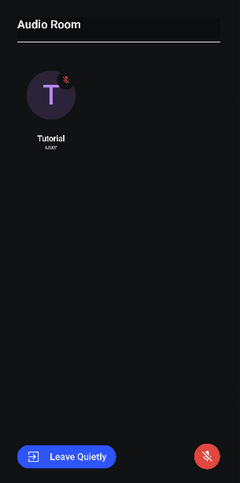
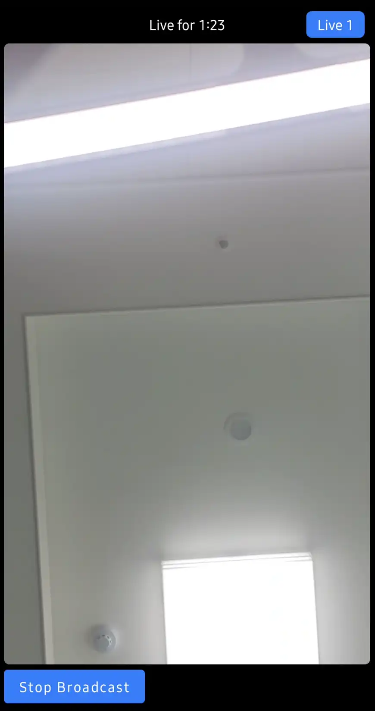

<h1 align="center">Android Video Samples</h1>

<p align="center">
  <a href="https://github.com/GetStream/Android-Video-Samples/actions/workflows/android.yml"></a>
  <a href="https://android-arsenal.com/api?level=21"></a>
  <a href="https://getstream.io"></a>
</p>

<p align="center">
  <a href="https://getstream.io/video/sdk/android/?utm_source=Github&utm_medium=Jaewoong_OSS&utm_content=Developer&utm_campaign=Github_April2024_Jaewoong_Android_Video_Samples&utm_term=DevRelOss">
    
  </a>
</p>

## 😎 Repo Overview

This repository contains sample projects, guides, tutorials, and links to helpful resources to help you get started with [Android Stream Video SDK](https://getstream.io/video/sdk/android/?utm_source=Github&utm_medium=Jaewoong_OSS&utm_content=Developer&utm_campaign=Github_April2024_Jaewoong_Android_Video_Samples&utm_term=DevRelOss).

<a href="https://getstream.io/video/sdk/android/?utm_source=Github&utm_medium=Jaewoong_OSS&utm_content=Developer&utm_campaign=Github_April2024_Jaewoong_Android_Video_Samples&utm_term=DevRelOss">

</a>

## 🔗 Quick Links

Stream offers seamless Video SDK solutions that allow you to implement video calling, audio/video room, and live streaming using Jetpack Compose. If you're interested in learning the Stream Video SDKs, check out the tutorials below:

- [Register For a Free Account](https://getstream.io/try-for-free/?utm_source=Github&utm_medium=Jaewoong_OSS&utm_content=Developer&utm_campaign=Github_Mar2024_Jaewoong_Android_Samples&utm_term=DevRelOss)
- [Android Video SDK Repository](https://github.com/GetStream/stream-video-android)

**Tutorials:**

- [Video Calling Tutorial](https://getstream.io/video/sdk/android/tutorial/video-calling/?utm_source=Github&utm_medium=Jaewoong_OSS&utm_content=Developer&utm_campaign=Github_Mar2024_Jaewoong_Android_Samples&utm_term=DevRelOss)
- [Audio Room Tutorial](https://getstream.io/video/sdk/android/tutorial/audio-room/?utm_source=Github&utm_medium=Jaewoong_OSS&utm_content=Developer&utm_campaign=Github_Mar2024_Jaewoong_Android_Samples&utm_term=DevRelOss)
- [Livestreaming Tutorial](https://getstream.io/video/sdk/android/tutorial/livestreaming/?utm_source=Github&utm_medium=Jaewoong_OSS&utm_content=Developer&utm_campaign=Github_Mar2024_Jaewoong_Android_Samples&utm_term=DevRelOss)

**Documentation:**

- [Compose UI Components Documentation](https://getstream.io/video/docs/android/ui-components/overview/?utm_source=Github&utm_medium=Jaewoong_OSS&utm_content=Developer&utm_campaign=Github_Mar2024_Jaewoong_Android_Samples&utm_term=DevRelOss)
- [UI Cookbook](https://getstream.io/video/docs/android/ui-cookbook/overview/?utm_source=Github&utm_medium=Jaewoong_OSS&utm_content=Developer&utm_campaign=Github_Mar2024_Jaewoong_Android_Samples&utm_term=DevRelOss)
- [Joining & Creating Calls](https://getstream.io/video/docs/android/guides/joining-creating-calls/?utm_source=Github&utm_medium=Jaewoong_OSS&utm_content=Developer&utm_campaign=Github_Mar2024_Jaewoong_Android_Samples&utm_term=DevRelOss)

## 🤝 Contribution

Submissions are always welcomed! You can create your own open-source project or sample app by creating a new module for this project following our **[Video Calling Tutorial](https://getstream.io/video/sdk/android/tutorial/video-calling/?utm_source=Github&utm_medium=Jaewoong_OSS&utm_content=Developer&utm_campaign=Github_Mar2024_Jaewoong_Android_Samples&utm_term=DevRelOss)**, **[Audio Room Tutorial](https://getstream.io/video/sdk/android/tutorial/audio-room/?utm_source=Github&utm_medium=Jaewoong_OSS&utm_content=Developer&utm_campaign=Github_Mar2024_Jaewoong_Android_Samples&utm_term=DevRelOss)**, or **[Livestreaming Tutorial](https://getstream.io/video/sdk/android/tutorial/livestreaming/?utm_source=Github&utm_medium=Jaewoong_OSS&utm_content=Developer&utm_campaign=Github_Mar2024_Jaewoong_Android_Samples&utm_term=DevRelOss)**. After building your project, create an issue or pull request. Your project will be categorized 😎 under our featuring list after reviewing the project in our team.

We also welcome code changes that improve the apps or fix a problem. Please follow all best practices and add tests if applicable before submitting a Pull Request on GitHub.

## 🚀 Main Samples

| Project | |
|:-----|---------|
|  <br><h3>Video Calling Sample</h3> <br>Demonstrates the video calling following the official [Video Calling Tutorial](https://getstream.io/video/sdk/android/tutorial/video-calling/?utm_source=Github&utm_medium=Jaewoong_OSS&utm_content=Developer&utm_campaign=Github_Mar2024_Jaewoong_Android_Samples&utm_term=DevRelOss).<br><br> **[> Source Code](https://github.com/GetStream/Android-Video-Samples/tree/main/video-call-sample/)**<br><br> |  |
|  |  |
|  <br><h3>Audio Room Sample</h3> <br>Demonstrates the audio room following the official [Audio Room Tutorial](https://getstream.io/video/sdk/android/tutorial/audio-room/?utm_source=Github&utm_medium=Jaewoong_OSS&utm_content=Developer&utm_campaign=Github_Mar2024_Jaewoong_Android_Samples&utm_term=DevRelOss).<br><br> **[> Source Code](https://github.com/GetStream/Android-Video-Samples/tree/main/audio-room-sample/)**<br><br> |  |
|  |  |
|  <br><h3>Livestreaming Sample</h3> <br>Demonstrates the livestreaming following the official [Livestreaming Tutorial](https://getstream.io/video/sdk/android/tutorial/livestreaming/?utm_source=Github&utm_medium=Jaewoong_OSS&utm_content=Developer&utm_campaign=Github_Mar2024_Jaewoong_Android_Samples&utm_term=DevRelOss).<br><br> **[> Source Code](https://github.com/GetStream/Android-Video-Samples/tree/main/livestreaming-sample/)**<br><br> |  |
|  |  |

## ✈️ Additional samples
| Project | |
|:-----|---------|
|  <br><h3>WhatsApp Clone Compose</h3> <br>WhatsApp clone project demonstrates modern Android development built with Jetpack Compose and Stream Chat/Video SDK for Compose.<br><br>• Implementing entire UI elements with Jetpack Compose<br>• Implementation of Android architecture components with Jetpack libraries such as Hilt and AppStartup<br>• Performing background tasks with Kotlin Coroutines<br>• Integrating chat systems with Stream Chat SDK for real-time event handling<br>• Integrating video call systems with Stream Video SDK using WebRTC under the hood<br><br>**[> Source Code](https://github.com/getstream/whatsapp-clone-compose)**<br>**[> Blog Post: Build a Real-Time Android WhatsApp Clone With Jetpack Compose](https://getstream.io/blog/build-whatsapp-clone/)**<br>**[> Blog Post: Build Video Calling for Your Android WhatsApp Clone With Jetpack Compose](https://getstream.io/blog/build-video-calling-compose/)**<br><br> |  |
|  |  |
|  <br><h3>TwitchClone Clone Compose</h3> <br>Twitch clone project demonstrates modern Android development built with Jetpack Compose and Stream Chat/Video SDK for Compose.<br><br>• Implementing entire UI elements with Jetpack Compose<br>• Implementation of Android architecture components with Jetpack libraries such as Hilt and AppStartup<br>• Performing background tasks with Kotlin Coroutines<br>• Integrating chat systems with Stream Chat SDK for real-time event handling<br>• Integrating video call systems with Stream Video SDK using WebRTC under the hood<br><br>**[> Source Code](https://github.com/skydoves/twitch-clone-compose)**<br><br> |  |
|  |  |
|  <br><h3>Meeting Room Compose</h3> <br>A real-time meeting room app built with Jetpack Compose to demonstrate video communications.<br><br>• Complete implementation of UI components using Jetpack Compose<br>• Development of a real-time meeting room application with a seamless user experience, designed in a Google Meet style by customizing CallContent and ParticipantVideo<br>• Performing background tasks with Kotlin Coroutines<br>• Creation of a lobby screen that provides control over physical devices before joining a meeting room, including toggling the camera/microphone and flipping the camera view<br>• Illustration of multiple participants connecting from various platforms, such as web and Android<br><br>**[> Source Code](https://github.com/skydoves/twitch-clone-compose)**<br>**[> Blog Post: Build a Real-Time Meeting App for Android with Jetpack Compose](https://getstream.io/blog/compose-meeting-room/)**<br><br> |  |
|  |  |
|  <br><h3>Zoom Clone Compose</h3> <br>Real-time Zoom clone application for Android, built with Jetpack Compose and Stream Video SDK for Compose.<br><br>• The development of comprehensive UI elements utilizing Jetpack Compose<br>• The use of Android architecture components alongside Jetpack libraries, including androidx ViewModel and Hilt<br>• Execution of background operations using Kotlin Coroutines<br>• Integration of real-time video meeting room functionalities through the Stream Video SDK, powered by WebRTC technology<br><br>**[> Source Code](https://github.com/wisemuji/zoom-clone-compose)**<br>**[> Blog Post: Build a Real-Time Zoom Clone with Jetpack Compose](https://getstream.io/blog/zoom-clone-compose/)**<br><br> |  |
|  |  |
|  <br><h3>Google Meet Clone Compose</h3> <br>Google Meet clone using Stream Video Call SDK & Jetpack Compose.<br><br>• Meeting room list screen<br>• Joining a meeting with a room id<br>• Creating a new meeting room<br>• Lobby screen• Real-time meeting room<br><br>**[> Source Code](https://github.com/workspace/google-meet-clone-compose)**<br>**[> Blog Post: Building a Google Meet Clone In Jetpack Compose](https://getstream.io/blog/google-meet-clone/)**<br><br> |  |
|  |  |

## Video Guides
See [here](https://getstream.io/video/docs/android/?utm_source=Github&utm_medium=Jaewoong_OSS&utm_content=Developer&utm_campaign=Github_Mar2024_Jaewoong_Android_Samples&utm_term=DevRelOss) for all our video guides.

These guides explore our UI components in greater detail and demonstrate how to easily perform a variety of common actions using the Stream Video Android SDK, such as:

- [Client & Authentication](https://getstream.io/video/docs/android/guides/client-auth/?utm_source=Github&utm_medium=Jaewoong_OSS&utm_content=Developer&utm_campaign=Github_Mar2024_Jaewoong_Android_Samples&utm_term=DevRelOss)
- [Joining & Creating Calls](https://getstream.io/video/docs/android/guides/joining-creating-calls/?utm_source=Github&utm_medium=Jaewoong_OSS&utm_content=Developer&utm_campaign=Github_Mar2024_Jaewoong_Android_Samples&utm_term=DevRelOss)
- [Adding Push Notifications](https://getstream.io/video/docs/android/advanced/push-notifications/?utm_source=Github&utm_medium=Jaewoong_OSS&utm_content=Developer&utm_campaign=Github_Mar2024_Jaewoong_Android_Samples&utm_term=DevRelOss)
- [Picture-in-Picture](https://getstream.io/video/docs/android/advanced/enable-picture-in-picture/?utm_source=Github&utm_medium=Jaewoong_OSS&utm_content=Developer&utm_campaign=Github_Mar2024_Jaewoong_Android_Samples&utm_term=DevRelOss)
- [Screen Sharing](https://getstream.io/video/docs/android/advanced/screen-sharing/?utm_source=Github&utm_medium=Jaewoong_OSS&utm_content=Developer&utm_campaign=Github_Mar2024_Jaewoong_Android_Samples&utm_term=DevRelOss)
- [Video & Audio Filters](https://getstream.io/video/docs/android/advanced/apply-video-filters/?utm_source=Github&utm_medium=Jaewoong_OSS&utm_content=Developer&utm_campaign=Github_Mar2024_Jaewoong_Android_Samples&utm_term=DevRelOss)
- [Chat Integration](https://getstream.io/video/docs/android/advanced/chat-with-video/?utm_source=Github&utm_medium=Jaewoong_OSS&utm_content=Developer&utm_campaign=Github_Mar2024_Jaewoong_Android_Samples&utm_term=DevRelOss)
- [Recording & Broadcasting](https://getstream.io/video/docs/android/advanced/recording/?utm_source=Github&utm_medium=Jaewoong_OSS&utm_content=Developer&utm_campaign=Github_Mar2024_Jaewoong_Android_Samples&utm_term=DevRelOss)

**Compose UI Components:**

- [VideoRenderer](https://getstream.io/video/docs/android/ui-components/video-renderer/)
- [CallContent](https://getstream.io/video/docs/android/ui-components/call/call-content/)
- [AudioCallContent](https://getstream.io/video/docs/android/ui-components/call/audio-call-content/)
- [ParticipantVideo](https://getstream.io/video/docs/android/ui-components/participants/participant-video/)
- [CallLobby](https://getstream.io/video/docs/android/ui-cookbook/lobby-preview/)
- [UI Cookbook](https://getstream.io/video/docs/android/ui-cookbook/overview/)
- [UI Previews](https://getstream.io/video/docs/android/ui-components/ui-previews/)
- [UI Testing](https://getstream.io/video/docs/android/ui-components/ui-testing/)

## What is Stream?

Stream allows developers to rapidly deploy scalable chat messaging and real-time video communication with an industry leading 99.999% uptime SLA guarantee.

With Stream's chat components, developers quickly add chat to their app for a variety of use-cases:

- Video calling & room like Zoom or Google Meet
- Audio room like Clubhouse
- Livestreams like Twitch or Youtube
- In-Game chat like Overwatch or Fortnite
- Team style chat like Slack
- Messaging style chat like Whatsapp or Facebook's messenger
- Commerce chat like Drift or Intercom

## 💼 We are hiring

We've recently closed a [\$38 million Series B funding round](https://techcrunch.com/2021/03/04/stream-raises-38m-as-its-chat-and-activity-feed-apis-power-communications-for-1b-users/) and we keep actively growing.
Our APIs are used by more than a billion end-users, and you'll have a chance to make a huge impact on the product within a team of the strongest engineers all over the world.

Check out our current openings and apply via [Stream's website](https://getstream.io/team/#jobs).    

## License

```
The MIT License (MIT)

Copyright (c) 2014-2024 Stream.io Inc. All rights reserved.

Permission is hereby granted, free of charge, to any person obtaining a copy
of this software and associated documentation files (the "Software"), to deal
in the Software without restriction, including without limitation the rights
to use, copy, modify, merge, publish, distribute, sublicense, and/or sell
copies of the Software, and to permit persons to whom the Software is
furnished to do so, subject to the following conditions:

The above copyright notice and this permission notice shall be included in
all copies or substantial portions of the Software.

THE SOFTWARE IS PROVIDED "AS IS", WITHOUT WARRANTY OF ANY KIND, EXPRESS OR
IMPLIED, INCLUDING BUT NOT LIMITED TO THE WARRANTIES OF MERCHANTABILITY,
FITNESS FOR A PARTICULAR PURPOSE AND NONINFRINGEMENT. IN NO EVENT SHALL THE
AUTHORS OR COPYRIGHT HOLDERS BE LIABLE FOR ANY CLAIM, DAMAGES OR OTHER
LIABILITY, WHETHER IN AN ACTION OF CONTRACT, TORT OR OTHERWISE, ARISING FROM,
OUT OF OR IN CONNECTION WITH THE SOFTWARE OR THE USE OR OTHER DEALINGS IN
THE SOFTWARE.
```
