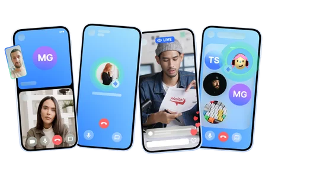

## Audio Room Sample



[The following tutorial](https://getstream.io/video/sdk/android/tutorial/audio-room/?utm_source=Github&utm_medium=Jaewoong_OSS&utm_content=Developer&utm_campaign=Github_Mar2024_Jaewoong_Android_Samples&utm_term=DevRelOss) shows you how to quickly build an Audio Room app leveraging Stream's Video API and the Stream Video Android components. The underlying API is very flexible and allows you to build nearly any type of video experience.

This tutorial will teach you how to build an audio room experience like Twitter Spaces or Clubhouse. The end result will look like the image below and support the following features:

- Backstage mode. You can start the call with your co-hosts and chat a bit before going live.
- Calls run on Stream's global edge network for optimal latency and scalability.
- There is no cap to how many listeners you can have in a room.
- Listeners can raise their hand, and be invited to speak by the host.
- Audio tracks are sent multiple times for optimal reliability.

Before running and building this project, you can check out the [How to build guidelines](../how-to-build.md).

```
The MIT License (MIT)

Copyright (c) 2014-2024 Stream.io Inc. All rights reserved.

Permission is hereby granted, free of charge, to any person obtaining a copy
of this software and associated documentation files (the "Software"), to deal
in the Software without restriction, including without limitation the rights
to use, copy, modify, merge, publish, distribute, sublicense, and/or sell
copies of the Software, and to permit persons to whom the Software is
furnished to do so, subject to the following conditions:

The above copyright notice and this permission notice shall be included in
all copies or substantial portions of the Software.

THE SOFTWARE IS PROVIDED "AS IS", WITHOUT WARRANTY OF ANY KIND, EXPRESS OR
IMPLIED, INCLUDING BUT NOT LIMITED TO THE WARRANTIES OF MERCHANTABILITY,
FITNESS FOR A PARTICULAR PURPOSE AND NONINFRINGEMENT. IN NO EVENT SHALL THE
AUTHORS OR COPYRIGHT HOLDERS BE LIABLE FOR ANY CLAIM, DAMAGES OR OTHER
LIABILITY, WHETHER IN AN ACTION OF CONTRACT, TORT OR OTHERWISE, ARISING FROM,
OUT OF OR IN CONNECTION WITH THE SOFTWARE OR THE USE OR OTHER DEALINGS IN
THE SOFTWARE.
```